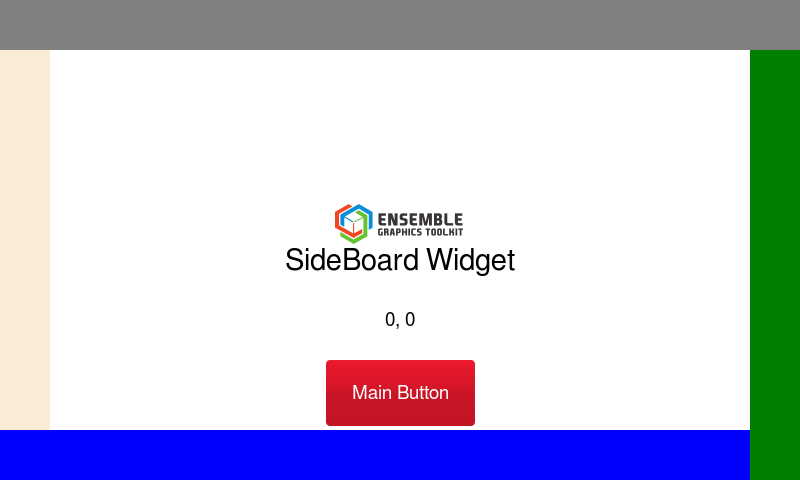
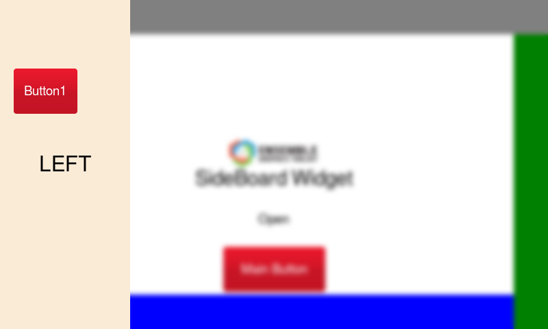

# Ensemble Graphics Toolkit Background Blur

Simple example showing two techniques.
1. Extended SideBoard control. The orignal sideboard control assumes it takes over the whole screen when it is made visible (of course if this was the case then there is no need to blur the backgorund because it would not be visible).
This modified control allows you to specify an initial Size for the panel. The final size of the panel will be this plus the handle bar. Note that you can pass in 0 as one of the Size parameters, if you do this then the panel will configure itself to use the maximum screen size in the direction.
2. In the example code board0 (the left board) has an event handler attached to it that detects the opening. When this occurs it re-renders the entire screen to a temporary image. This image is then blurred using a gaussian filter and returned as an imagelabel object. The imagelabel is then placed at the top of the window stack effectively hiding the other objects with a blurred image of them. This also prevents them from responding to events. Finally the left side board is popped to the top of the Z order to make it work. On closing the board the image object is deleted.

### Original Screen

### Blurred Screen

